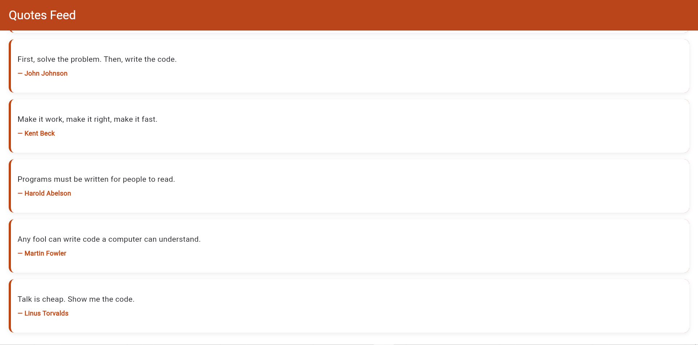

# Quotes Feed — ListView Demo

A scrollable, Yelp-style feed of quote cards built with Flutter's `ListView` widget.

## Run Instructions

```bash
flutter pub get
flutter run
```

## The Three Attributes Demonstrated

The `ListView.builder` in `lib/main.dart` sets three properties:

1. **`scrollDirection: Axis.vertical`** — the feed scrolls top-to-bottom (the default, but set explicitly here for clarity).
2. **`padding: EdgeInsets.all(16)`** — adds 16px of space around the whole list, so cards aren't flush against the screen edges.
3. **`itemExtent: 110`** — forces every card to a fixed height of 110px instead of letting Flutter measure each one, which improves scroll performance.

## Screenshot

<!-- Replace with your own screenshot before submitting -->


## In-Class Presentation Date

<!-- Fill in the date you presented, e.g. July 17, 2026 -->
Presented on: 15 June 2026